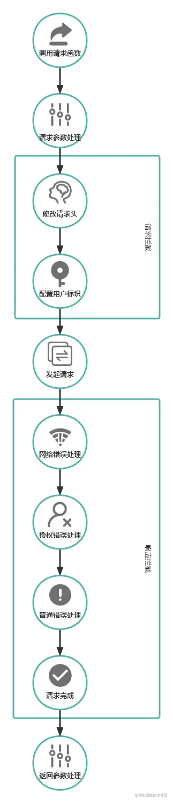

讲个笑话：我以前以为模板就是框架

# 模板

简单点说，就是开发的时候一大堆工具的集成体，相当于工具箱咯！

好啦！等我地哩组装自己的工具箱啦！

## init a project
选个pnpm做包管理啦梗系！因为一阵要用vue所以选vite做打包工具
```
pnpm create vite
// 然后跟着指引选vue，typescript

// 框架被建出来之后你会获得一个由vue和typescript建成的最初模板（干净的一笔）
pnpm i
pnpm dev
// 出来一个vue的模板页面
```

## 集成（presets/presets.ts）
### 保证vue的运行(支持vue模板的识别与编译)
```
pnpm add @vitejs/plugin-vue @vitejs/plugin-vue-jsx -D
```
```ts
import vue from '@vitejs/plugin-vue';
import vueJsx from '@vitejs/plugin-vue-jsx';

export default [
    vue(),
    vueJsx(),
]
```
### add css
原子化css unocss
```
pnpm add unocss -D
```

```ts
// presets/presets.ts
import Unocss from 'unocss/vite'

export default [
    Unocss(),
]
```

```ts
// main.ts
import 'uno.css'
```
### 自动引入插件
```
pnpm add unplugin-auto-import -D
```
```ts
import AutoImport from 'unplugin-auto-import/vite';

export default [
    AutoImport({
        include: [ // 扫描范围
            /\.[tj]sx?$/, // .ts, .tsx, .js, .jsx
            /\.vue$/, /\.vue\?vue/, // .vue
            /\.md$/, // .md
        ],
        imports: [ // 你需要自动引入什么插件
            'vue'
        ],
        dts: './src/types/auto-imports.d.ts', // 要生成相应的类，不然过不了ts
    })
]
```
### 自动引入组件
```
npm install unplugin-vue-components -D
npm install vite-plugin-style-import -D
```
```ts
import Components from 'unplugin-vue-components/vite';
import { VantResolver, NaiveUiResolver } from 'unplugin-vue-components/resolvers';
import {
  createStyleImportPlugin,
  VantResolve
} from 'vite-plugin-style-import'


export default [
    Components({
        dirs: ['src/components/'], // 我地滴组件肯定写启哩到葛嘛
        extensions: ['vue'], //  // 组件的有效文件扩展名
        include:[/\.vue$/, /\.vue\?vue/], // 扫描范围
        resolvers: [
            VantResolver(), // 移动ui库
            NaiveUiResolver(), // PC端UI库
        ], // ui库解析器
        dts: './src/types/components.d.ts', // 要生成相应的类，不然过不了ts，在src下建types文件夹
    }),
    createStyleImportPlugin({
      resolves: [
        VantResolve()
      ],
    }),
]
```

### 图标库
```
pnpm add -D @iconify/json
```
```ts
import Icons from 'unplugin-icons/vite'
import IconsResolver from 'unplugin-icons/resolver'
import { FileSystemIconLoader } from 'unplugin-icons/loaders';

export default [
    Components({
        resolvers: [
            IconsResolver({ customCollections: ['custom'] }),
        ]
    }),
    Icons({
        compiler: 'vue3', // 适应vue3依赖
        customCollections: {
          custom: FileSystemIconLoader('./assets/svg'), // 自定义目录
        },
        autoInstall: true, // 自动安装
    }),
]
```
```vue
  <i-mdi-account-box />
  <i-mdi-alarm-off />
```

### 字体库
```
pnpm add vite-plugin-fonts -D
```

```ts
import ViteFonts from 'vite-plugin-fonts';

export default [
    ViteFonts({
      google: {
        families: ['Open Sans', 'Montserrat', 'Fira Sans'],
      },
    }),
]
```

### 国际化
```
pnpm add @intlify/vite-plugin-vue-i18n -D
```

```ts
import VueI18n from '@intlify/vite-plugin-vue-i18n';

export default [
    VueI18n({
        include: ['../src/locales/'], // 翻译目录,在src下新建locales文件夹
    }),
]
```

```ts
// main.ts
import { createI18n } from 'vue-i18n'

import en from './locales/en.json'
import zh from './locales/zh-CN.json'

const i18n = createI18n({
    locale: 'zh',
    messages: {
      en,
      zh
    }
})

app.use(i18n)
```
```json
{
  "language": "English"
}
```
```json
{
  "language": "中文"
}
```
```vue
 <div>{{ $t('language') }}</div>
```

## 规范化
### ESLint（规范语法）
```
pnpm i -D eslint
npx eslint --init
上面的初始化会提示你下载下面这些
pnpm i eslint eslint-plugin-vue --save-dev
由于 ESLint 默认无法识别 TypeScript，需要安装 @typescript-eslint/parser 替代掉默认的解析器。
pnpm install @typescript-eslint/parser --save-dev
安装 @typescript-eslint/eslint-plugin 作为 eslint 默认规则的补充，提供了适用于 ts 语法的规则。
pnpm install @typescript-eslint/eslint-plugin --save-dev
```
最后在package.json中添加命令
```json
"eslint:comment": "使用 ESLint 检查并自动修复 src 目录下所有扩展名为 .js 和 .vue 的文件",
"eslint": "eslint --ext .js,.vue --ignore-path .gitignore --fix src"
```

```.eslintrc.cjs 
    // 配置vue3、ts
    "parser": "vue-eslint-parser",
    "parserOptions": {
        "parser": "@typescript-eslint/parser",
    },
```
### Prettier（规范格式）
```
pnpm i prettier eslint-config-prettier eslint-plugin-prettier --save-dev
```
在根目录新建.prettierrc.js
```package.json
  "prettier:comment": "自动格式化当前目录下的所有文件",
  "prettier": "prettier --write"
```

### 解决eslint与prettier的冲突

eslint-plugin-prettier： 基于 prettier 代码风格的 eslint 规则，即eslint使用pretter规则来格式化代码。
eslint-config-prettier： 禁用所有与格式相关的 eslint 规则，解决 prettier 与 eslint 规则冲突，确保将其放在 extends 队列最后，这样它将覆盖其他配置

```
pnpm add eslint-config-prettier eslint-plugin-prettier -D
```

```.eslintrc.cjs 
   { 
    extends: [
      'eslint:recommended',
      'plugin:vue/vue3-essential',
      'plugin:@typescript-eslint/recommended',
  +    // 新增，必须放在最后面
  +   'plugin:prettier/recommended' 
    ],
  }
```

### lint-staged
lint-staged能够让lint只检测暂存区的文件，所以速度很快。
```
pnpm add lint-staged -D
```


### stylelint（规范css）

```
pnpm add stylelint postcss postcss-less postcss-html stylelint-config-prettier stylelint-config-recommended-scss stylelint-config-standard stylelint-config-standard-vue stylelint-scss stylelint-order -D
```
```package.json
"stylelint": "stylelint \"./**/*.{css,less,vue,html}\" --fix"
```

### husky（规范提交）

```
pnpm add husky -D
```
```package.json
"prepare": "husky install"
```
```
pnpm husky add .husky/pre-commit "pnpm lint && pnpm format && pnpm lint:style"
```
该命令会在pnpm install之后运行，这样其他克隆该项目的同学就在装包的时候就会自动执行该命令来安装husky。

### commitlint和commitizen(提交规范)
commitlint规范提交插件
@commitlint/config-conventional 共享提交配置强制常规提交
commitlint-config-cz相关配置
cz-customizable自定义配置

```
pnpm i commitlint @commitlint/config-conventional -D
npm set-script commit "git add . && git-cz"
npx commitizen init cz-conventional-changelog --save-dev --save-exact
pnpm i -D commitlint-config-cz  cz-customizable
```
根目录新建commitlint.config.js和cz-config.js
```commitlint.config.js
module.exports = {
    extends:  ['cz'],
    rules: {
        // 自定义规则
    }
}
```
```cz-config.js
'use strict'
module.exports = {
  types: [
    { value: '✨新增', name: '新增:    新的内容' },
    { value: '🐛修复', name: '修复:    修复一个Bug' },
    { value: '📝文档', name: '文档:    变更的只有文档' },
    { value: '💄格式', name: '格式:    空格, 分号等格式修复' },
    { value: '♻️重构', name: '重构:    代码重构，注意和特性、修复区分开' },
    { value: '⚡️性能', name: '性能:    提升性能' },
    { value: '✅测试', name: '测试:    添加一个测试' },
    { value: '🔧工具', name: '工具:    开发工具变动(构建、脚手架工具等)' },
    { value: '⏪回滚', name: '回滚:    代码回退' }
  ],
  scopes: [
    { name: 'leetcode' },
    { name: 'javascript' },
    { name: 'typescript' },
    { name: 'Vue' },
    { name: 'node' }
  ],
  // it needs to match the value for field type. Eg.: 'fix'
  /*  scopeOverrides: {
    fix: [
      {name: 'merge'},
      {name: 'style'},
      {name: 'e2eTest'},
      {name: 'unitTest'}
    ]
  },  */
  // override the messages, defaults are as follows
  messages: {
    type: '选择一种你的提交类型:',
    scope: '选择一个scope (可选):',
    // used if allowCustomScopes is true
    customScope: 'Denote the SCOPE of this change:',
    subject: '短说明:\n',
    body: '长说明，使用"|"换行(可选)：\n',
    breaking: '非兼容性说明 (可选):\n',
    footer: '关联关闭的issue，例如：#31, #34(可选):\n',
    confirmCommit: '确定提交说明?(yes/no)'
  },
  allowCustomScopes: true,
  allowBreakingChanges: ['特性', '修复'],
  // limit subject length
  subjectLimit: 100
}
```

```package.json
  // package.json
    "config": {
        "commitizen": {
            "path": "node_modules/cz-customizable"
        }
    }
```
### changeLog And version(使用conventional-changelog-cli和standard-version)
```
// 下载
npm install -s conventional-changelog-cli

// 配置 package.json
"scripts": {
    "changelog": "conventional-changelog -p angular -i CHANGELOG.md -s -r 0"
}
```
```
// 下载
npm install --save-dev standard-version

// 配置 package.json
"scripts": {
    "release": "standard-version"
}
```
## 功能插件

### pinia大菠萝
```
 pnpm i pinia --save
```
新建src/store/index.ts
```
 import { createPinia } from 'pinia'

 const store = createPinia()

 export default store
```
在main.ts中引入和挂载
```
  import store from './store'
  // 挂载pinia
  app.use(store)
```

### vue-router
```
pnpm i vue-router --save
```
新建src/router/index.ts
```
 import { createRouter, createWebHistory, RouteRecordRaw } from 'vue-router';

 const routes: Array<RouteRecordRaw> = [
   {
       path: '/',
       name: 'Index',
       meta: {
           title: '首页',
           keepAlive: true,
           requireAuth: true
       },
       component: () => import('@/view/index.vue')
   }
 ]

 const router = createRouter({
   history: createWebHistory(),
   routes
 });
 export default router;
```
在main中引入和挂载
```
import router from './router';
app.use(router);
```
在App.vue中使用
```
 <template>
   <RouterView/>
 </template>
 ```
### vue-use
它是一个基于 Composition API 的实用函数集合
```
 pnpm i @vueuse/core
```
### axios
```
pnpm i axios
```
封装

这里就不得不说说封装的意义：我们先说说如果不封装会怎么样？没有拦截器，每次需要对参数、用户标识进行修改时就要写一次，所以封装能够极大提高代码的复用性。

这是从人家文章挖的图。暂时先用着。

这图突出了封装的两个要点：流程 + 拦截

#### index.ts主流程
```typescript
import axios from "axios"

type ResponseHandle = (data: ResponseData<any>) => unknown

interface RequestData {
  [key: string]: unknown
}

interface ResponseData<T> {
  errno: string
  errmsg: string
  data: T
}

const get = <T,>(url: string, params: RequestData = {}, filter?: ResponseHandle): Promise<[any, ResponseData<T> | undefined]> =>
  new Promise((resolve) => {
    axios
      .get(url, { params })
      .then((result) => {
        let res: ResponseData<T>
        if (filter !== undefined) {
          res = filter(result.data) as unknown as ResponseData<T>
        } else {
          res = result.data as ResponseData<T>
        }
        resolve([null, res as ResponseData<T>])
      })
      .catch((err) => {
        resolve([err, undefined])
      })
  })

  export const post = <T,>(url: string, data: RequestData, params: RequestData = {}): Promise<[any, ResponseData<T> | undefined]> => {
    return new Promise((resolve) => {
      axios
        .post(url, data, { params })
        .then((result) => {
          resolve([null, result.data as ResponseData<T>])
        })
        .catch((err) => {
          resolve([err, undefined])
        })
    })
  }
  
  export const put = <T,>(url: string, data: RequestData, params: RequestData = {}): Promise<[any, ResponseData<T> | undefined]> => {
    return new Promise((resolve) => {
      axios
        .post(url, data, { params })
        .then((result) => {
          resolve([null, result.data as ResponseData<T>])
        })
        .catch((err) => {
          resolve([err, undefined])
        })
    })
  }

  export const del = <T,>(url: string, data: RequestData, params: RequestData = {}): Promise<[any, ResponseData<T> | undefined]> => {
    return new Promise((resolve) => {
      axios
        .post(url, data, { params })
        .then((result) => {
          resolve([null, result.data as ResponseData<T>])
        })
        .catch((err) => {
          resolve([err, undefined])
        })
    })
  }
```
#### 错误处理
```typescript
const handleNetworkError = (errStatus) => {
    let errMessage = '未知错误'
    if (errStatus) {
        switch (errStatus) {
            case 400:
                errMessage = '错误的请求'
                break
            case 401:
                errMessage = '未授权，请重新登录'
                break
            case 403:
                errMessage = '拒绝访问'
                break
            case 404:
                errMessage = '请求错误,未找到该资源'
                break
            case 405:
                errMessage = '请求方法未允许'
                break
            case 408:
                errMessage = '请求超时'
                break
            case 500:
                errMessage = '服务器端出错'
                break
            case 501:
                errMessage = '网络未实现'
                break
            case 502:
                errMessage = '网络错误'
                break
            case 503:
                errMessage = '服务不可用'
                break
            case 504:
                errMessage = '网络超时'
                break
            case 505:
                errMessage = 'http版本不支持该请求'
                break
            default:
                errMessage = `其他连接错误 --${errStatus}`
        }
    } else {
        errMessage = `无法连接到服务器！`
    }

    translateError(errMessage)

    return errMessage;
}

const handleAuthError = (errno) => {
	const authErrMap: any = {
	  '10031': '登录失效，需要重新登录', // token 失效
	  '10032': '您太久没登录，请重新登录~', // token 过期
	  '10033': '账户未绑定角色，请联系管理员绑定角色',
	  '10034': '该用户未注册，请联系管理员注册用户',
	  '10035': 'code 无法获取对应第三方平台用户',
	  '10036': '该账户未关联员工，请联系管理员做关联',
	  '10037': '账号已无效',
	  '10038': '账号未找到',
	}
	
    translateError(errno)

	if (authErrMap.hasOwnProperty(errno)) {
        // 用组件提示
		// message.error(authErrMap[errno])
		// 授权错误，登出账户
		// logout()
		return false
	}

	return true
}

const handleGeneralError = (errno, errmsg) => {
	if (errno !== '0') {
        translateError(errmsg)
        // 用组件提示
		// meessage.error(err.errmsg)
		return false
	}

	return true
}

const translateError = (msg) => {
    // 通过组件和翻译逻辑给用户看错误原因
    console.log(msg)
}

export default {
    handleNetworkError,
    handleAuthError,
    handleGeneralError
}
```
#### 请求拦截器
```typescript
import axios from "axios"
import handleError from "./handleError"

const handleRequestHeader = (config) => {
    config['secret'] = 'md5'
    return config
}

const handleAuth = (config) => {
    const token = '123'
    config.header['token'] = localStorage.getItem('token') || token || ''
    return config
}

axios.interceptors.request.use((config) => {
    config = handleRequestHeader(config)
    config = handleAuth(config)
    return config
}, (err) => {
     handleError.handleGeneralError(-1, err)
     Promise.reject(err)
})
```
#### 响应拦截器
```typescript
import axios from "axios"
import handleError from "./handleError"

axios.interceptors.response.use(
    (response) => {
        // 响应处理
        if (response.status !== 200) return Promise.reject(response.data)

        handleError.handleAuthError(response.data.errno)
        handleError.handleGeneralError(response.data.errno, response.data.errmsg)

        return response
    },
    (err) => {
        // 对响应错误做处理
        handleError.handleNetworkError(err.response.status)
        Promise.reject(err.response)
    }
)
```

### postcss
它是一个 CSS 语法转换工具。
安装
```
pnpm install postcss-cli
pnpm install postcss
```
#### 插件
##### autoprefixer
自动给兼容性差 的属性增加浏览器前缀，提高代码兼容性
```js
module.exports = {
    plugins: [
        autoprefixer({
            //兼容市面所有版本浏览器
            browsers: ['> 0% '],
        }),
    ],
};
```
##### postcss-scss
允许你使用 SCSS (但并没有将 SCSS 编译到 CSS)。
```
pnpm install sass sass-loader -D
```
```js
module.exports = {
    syntax: 'postcss',
};
```
##### postcss-px-to-viewport-8-plugin
```
pnpm i postcss-px-to-viewport-8-plugin -D
```
```js
module.exports = {
  plugins: {
    'postcss-px-to-viewport-8-plugin': {
      unitToConvert: 'px', // 需要转换的单位
      viewportWidth: 375, // 视口宽度，等同于设计稿宽度
      unitPrecision: 5, // 精确到小数点后几位
      /**
       * 将会被转换的css属性列表，
       * 设置为 * 表示全部，如：['*']
       * 在属性的前面或后面设置*，如：['*position*']，*position* 表示所有包含 position 的属性，如 background-position-y
       * 设置为 !xx 表示不匹配xx的那些属性，如：['!letter-spacing'] 表示除了letter-spacing 属性之外的其他属性
       * 还可以同时使用 ! 和 * ，如['!font*'] 表示除了font-size、 font-weight ...这些之外属性之外的其他属性名头部是‘font’的属性
       * */
      propList: ['*'],
      viewportUnit: 'vw', // 需要转换成为的单位
      fontViewportUnit: 'vw', // 需要转换称为的字体单位
      /**
       * 需要忽略的选择器，即这些选择器对应的属性值不做单位转换
       * 设置为字符串，转换器在做转换时会忽略那些选择器中包含该字符串的选择器，如：['body']会匹配到 .body-class，也就意味着.body-class对应的样式设置不会被转换
       * 设置为正则表达式，在做转换前会先校验选择器是否匹配该正则，如果匹配，则不进行转换，如[/^body$/]会匹配到 body 但是不会匹配到 .body
       */
      selectorBlackList: [],
      minPixelValue: 1, // 最小的像素单位值
      mediaQuery: false, // 是否转换媒体查询中设置的属性值
      replace: true, // 替换包含vw的规则，而不是添加回退
      /**
       * 忽略一些文件，如'node_modules'
       * 设置为正则表达式，将会忽略匹配该正则的所有文件
       * 如果设置为数组，那么该数组内的元素都必须是正则表达式
       */
      exclude: [],
      landscape: false, // 是否自动加入 @media (orientation: landscape)，其中的属性值是通过横屏宽度来转换的
      landscapeUnit: 'vw', // 横屏单位
      landscapeWidth: 1334, // 横屏宽度
    },
  },
};
```
## 环境配置
在根目录新建.env.test, .env.development, .env.production
```
//.env.production
NODE_ENV = 'production'
VUE_APP_MODE = 'production'
VUE_APP_API_URL = 'http://xxx.xxx.xxx.xx:8008/api/'
```

```
//.env.development
NODE_ENV = 'development'  //模式
VUE_APP_MODE = 'development'  //通过"VUE_APP_MODE"变量来区分环境
VUE_APP_API_URL = 'http://192.****:8008/api/' //api地址
```
```
//.env.test
NODE_ENV = 'production'
VUE_APP_MODE = 'test'
VUE_APP_API_URL = 'http://xxx.xxx.xxx.xx:8008/api/'
outputDir = test
```

## 业务（mock.js）

虚拟数据代替接口

```
npm install mockjs
```